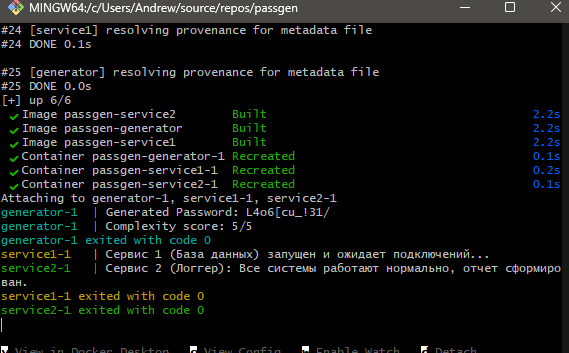
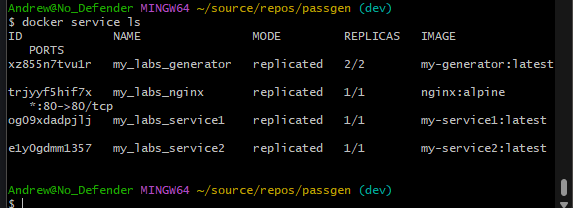

# Отчет лабораторных работ 3.1 и 3.2

Проект: passgen  
Ветка на GitHub: dev/main  

---

## Часть 1. Практическая работа номер 3.1: Контейнеризация микросервисного приложения с использованием Docker и Docker Compose

## Цель работы
Изучить принципы контейнеризации приложений, разработать конфигурационные файлы Dockerfile для изолированных микросервисов и настроить их одновременный локальный запуск с помощью Docker Compose.

### 1. Описание архитектуры приложения
В рамках работы монолитное приложение для генерации паролей passgen было разделено на три независимых микросервиса:
* generator — основной сервис на языке C++ (Passgen.cpp), выполняющий генерацию безопасных паролей и оценку их криптостойкости.
* service1 — имитация микросервиса базы данных на языке Python.
* service2 — вспомогательный сервис логирования на базе дистрибутива Alpine Linux.

### 2. Спецификация конфигурационных файлов Dockerfile
Для каждого микросервиса был создан файл Dockerfile, описывающий пошаговый процесс сборки изолированного образа.

Dockerfile сервиса generator:
```dockerfile
FROM gcc:latest
WORKDIR /app
COPY Passgen.cpp .
RUN g++ -o myapp Passgen.cpp
CMD ["./myapp"]
```

Dockerfile сервиса service1:
```dockerfile
FROM python:3.9-slim
COPY app.py .
CMD ["python", "app.py"]
```

Dockerfile сервиса service2:
```dockerfile
FROM alpine:latest
CMD ["echo", "Привет! Я - Сервис 1, и я работаю внутри Docker без установки Python на Windows!"]
```

### 3. Конфигурация Docker Compose
Для оркестрации локального запуска в корневом каталоге проекта был создан манифест docker-compose.yml, связывающий сервисы в единую сеть:
```yaml
version: '3.8'
services:
  generator:
    build: ./generator
  service1:
    build: ./service1
    depends_on:
      - generator
  service2:
    build: ./service2
    depends_on:
      - service1
```

### 4. Результаты работы приложения
Запуск и сборка контейнеров осуществлялись командой docker-compose up --build. Контейнеры успешно развернулись, выполнили свои сценарии и вывели логи в общий поток терминала.

Процесс скачивания базовых образов и сборки:


Вывод логов Docker Compose:


---

## Часть 2. Практическая работа номер 3.2: Развертывание и масштабирование микросервисов в кластере Docker Swarm с балансировкой нагрузки через Nginx

## Цель работы
Изучить основы оркестрации контейнеров с помощью Docker Swarm, настроить масштабирование компонентов и реализовать единую точку входа на базе веб-сервера Nginx.

### 1. Инициализация кластера оркестрации
Перевод локального демона Docker в режим полноценного менеджера кластера осуществлен командой `docker swarm init`.

### 2. Подготовка инфраструктуры и предотвращение преждевременного завершения
Поскольку Swarm рассчитан на непрерывно работающие веб-сервисы, в конфигурацию запусков (инструкции CMD) была внедрена заглушка `tail -f /dev/null`. Это позволило удерживать контейнеры в состоянии Running для имитации постоянной доступности. Была произведена предварительная локальная сборка тегов образов с помощью команд `docker build`.

### 3. Модернизация манифеста для Swarm
Файл конфигурации был переписан под требования Swarm-стека. Добавлен сервис nginx в качестве прокси-сервера, а также декларативные инструкции deploy для создания двух реплик генератора:
```yaml
version: '3.8'
services:
  nginx:
    image: nginx:alpine
    ports:
      - "80:80"
    deploy:
      replicas: 1

  generator:
    image: my-generator:latest
    deploy:
      replicas: 2

  service1:
    image: my-service1:latest
    deploy:
      replicas: 1

  service2:
    image: my-service2:latest
    deploy:
      replicas: 1
```

### 4. Развертывание стека и проверка отказоустойчивости
Развертывание инфраструктуры выполнено командой `docker stack deploy -c docker-compose.yml my_labs`. Проверка распределения реплик внутри кластера и их текущего статуса осуществлялась системной командой `docker service ls`.

Статус задач в Swarm:


Стабильные реплики Swarm:


---

## Выводы по работе
В результате выполнения комплекса лабораторных работ были успешно освоены технологии контейнеризации Docker и оркестрации Docker Swarm. Стек микросервисов изолирован в рамках внутренней сети, настроено масштабирование вычислительного узла генерации паролей до двух реплик, и развернут фронтальный шлюз Nginx. Весь исходный код и конфигурационные файлы зафиксированы в удаленной ветке dev текущего репозитория GitHub.
